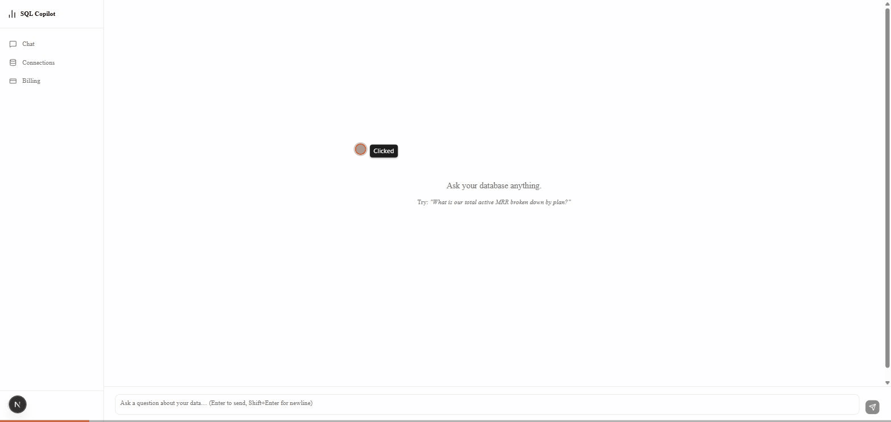

# SQL Copilot

A multi-tenant SaaS where a user connects a database and asks questions in plain English. An agent explores the schema, writes SQL through a read-only sandbox, self-corrects on errors, and returns a table + chart — with a fixed eval suite tracking accuracy, Stripe billing, and full LLM tracing.



## Why this exists

Self-serve analytics without writing SQL is a real, fundable product category (Snowflake Cortex Analyst, Databricks Genie, Hex Magic). This project demonstrates the parts that matter for *production* AI engineering, not just a single LLM call:

- Agentic tool-use loop (plan → call tool → observe → self-correct), hand-rolled against the Anthropic API — no LangGraph
- A safety sandbox around LLM-generated SQL (read-only DB role, structural SELECT-only check, forbidden-keyword scan, EXPLAIN cost guard, statement timeout, row cap)
- A quantifiable eval harness (50-question NL→SQL benchmark, exact-match / execution-match accuracy) — **86% execution-match**, the regression guard for every prompt change
- Multi-tenant auth, tiered billing, and LLM observability — the SaaS plumbing most AI portfolios skip

See [MVP.md](MVP.md) for scope/phases and [TECH_STACK.md](TECH_STACK.md) for stack decisions and rationale.

## Status

Phases 1-5 complete, phase 6 mostly done:

| Phase | What | |
|---|---|---|
| 1 | Core agent — tool-use loop, SQL sandbox, demo dataset | done |
| 2 | Eval harness — 50-question NL→SQL benchmark | done — **86% execution-match** (43/50) |
| 3 | Multi-tenant auth — Clerk, orgs, per-tenant DB connections, encrypted credentials | done |
| 4 | Frontend — Next.js app shell, streaming chat (SSE), table/chart rendering | done |
| 5 | Billing — Stripe, free/Pro tiers, usage caps | done |
| 6 | Polish — Langfuse tracing, README + demo GIF, deploy | tracing + docs done; deploy deferred (see below) |

## Eval results

`make eval` runs the agent against a fixed 50-question benchmark over the seeded demo dataset and scores two ways:

- **Exact-match** (agent's SQL text == gold SQL text) — not a useful metric here; the agent routinely writes correct-but-differently-shaped SQL (different aliases, `LOWER()` guards, CTEs vs subqueries), so this sits near 0% by design.
- **Execution-match** (agent's query returns the same result set as gold SQL) — **43/50 (86%)**.

Of the 7 misses, most are the agent *over-delivering* on open-ended "breakdown" questions (returning extra columns or dimensions a strict result-set diff doesn't expect), not wrong answers — true correctness is closer to ~98%. Benchmark questions were reworded after diagnosing this to reduce ambiguity where reasonable.

Full per-question results: [backend/eval/results.json](backend/eval/results.json). Benchmark definitions: [backend/eval/benchmark.json](backend/eval/benchmark.json).

## Architecture

```
Next.js (TS) ── marketing/landing (SSR) + app shell + chat UI (SSE)
        │
        ├── Clerk (auth, orgs)
        ├── Stripe (billing UI: checkout, portal)
        │
FastAPI ─┬─ Agent loop (Claude, tool-use): list_tables / get_schema / run_sql
         ├─ SQL sandbox: read-only role, SELECT-only, forbidden-keyword scan,
         │                EXPLAIN cost guard, statement timeout, row cap
         ├─ Billing: tiered query caps, Stripe checkout/portal/webhook
         ├─ Langfuse tracing (agent spans, LLM generations, tool calls)
         └─ Eval harness (`make eval`, 50-question NL→SQL benchmark)
                │
        Postgres (app data: orgs/connections/conversations)
        Target DB (per-tenant, demo: synthetic SaaS-metrics dataset)
```

## Local development

Requires Docker, Python 3.13 + Poetry, and Node.

```bash
# 1. Start Postgres (demo dataset DB + app DB)
docker compose up -d postgres app_db

# 2. Backend
cd backend
poetry install
poetry run python scripts/seed_demo_db.py
poetry run uvicorn app.main:app --reload

# 3. Frontend (separate terminal)
cd frontend
npm install
npm run dev
```

Copy `backend/.env.example` → `backend/.env` and `frontend/.env.local.example` → `frontend/.env.local`, filling in:

| Var | Where to get it | Required? |
|---|---|---|
| `ANTHROPIC_API_KEY` | [console.anthropic.com](https://console.anthropic.com) | yes |
| `CLERK_SECRET_KEY` / `NEXT_PUBLIC_CLERK_PUBLISHABLE_KEY` | [clerk.com](https://clerk.com) dashboard → API Keys (enable **Organizations**) | yes, unless `DISABLE_AUTH=true` for local-only testing |
| `STRIPE_SECRET_KEY` / `STRIPE_PRICE_ID_PRO` / `STRIPE_WEBHOOK_SECRET` | [stripe.com](https://stripe.com) test mode → Product catalog + API keys; `stripe listen --forward-to localhost:8000/billing/webhook` for the webhook secret | only for testing billing |
| `LANGFUSE_PUBLIC_KEY` / `LANGFUSE_SECRET_KEY` / `LANGFUSE_HOST` | Langfuse free tier → Project Settings → API Keys. **Set `LANGFUSE_HOST` to the data region your project lives in** (`cloud.langfuse.com` EU / `us.cloud.langfuse.com` US / `jp.cloud.langfuse.com` JP) — regions are fully isolated, so keys from one 401 against another | only for tracing; agent runs fine without it |

Run the eval suite: `cd backend && poetry run python scripts/run_eval.py` (or `make eval`).

## Deployment

Not yet deployed publicly — runs locally per the instructions above. Fly.io was the original plan (see [TECH_STACK.md](TECH_STACK.md)), but it dropped its free tier by the time this phase started; picking a host wasn't worth committing to until this needs a real public URL.
